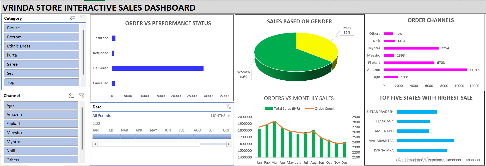

# Vrinda Store Insight
This interactive Excel dashboard offers a full view of Vrinda Store’s sales, customer trends, and fulfillment efficiency. It integrates data from multiple e-commerce platforms and enables filtering by category, region, and demographics to track orders, optimize channels, and uncover growth opportunities.

**Title:** [Vrinda Store Insight](https://github.com/Osiwi/github.io/blob/main/Vrinda%20Interactive%20Dashboard_Cleaned.xlsx)

**Tools & Technologies Used:** 
Microsoft Excel: Primary tool for creating the interactive sales dashboard.
Pivot Tables & Pivot Charts: Used to summarize performance metrics such as sales by state, category, channel, and gender.
Slicers & Timeline Filters: Enabled dynamic filtering by category, channel, and order dates for detailed data exploration.
Combo Charts & Pie Charts: Visualized categorical insights (e.g., gender-based sales, order statuses, top-performing states).
Power Query (Get & Transform): Used for cleaning and shaping raw order and sales data.
Bar Charts & Trend Lines: Provided comparative analysis for order channels, performance status, and monthly sales activity.

**Project Description Overview:**
This interactive Excel dashboard provides a comprehensive view of Vrinda Store’s sales performance, customer trends, and fulfillment efficiency. By integrating sales data from multiple e-commerce platforms and filtering by category, geography, and customer demographics, the dashboard empowers business managers to monitor order trends, optimize channels, and identify revenue growth opportunities.

**Objective:**
To track and analyze e-commerce sales performance across order statuses, product categories, customer gender, sales channels, and geographic regions—enabling informed strategic decisions for online retail optimization.

**Key Features Included in the Dashboard:**
Order vs Performance Status: Visual breakdown of order outcomes (Delivered, Returned, Refunded, Cancelled), highlighting operational efficiency.
Sales Based on Gender: Pie chart showing gender-wise contribution to total sales, with women accounting for the majority.
Order Channels: Bar chart comparison of sales volume across platforms like Amazon, Flipkart, Myntra, Meesho, and others.
Orders vs Monthly Sales: Combo chart revealing monthly sales values (INR) and corresponding order volume trends.
Top Five States by Sales: Bar chart showing the leading states in terms of sales revenue.
Interactive Filters: Slicers for category, sales channel, and time period enable targeted analysis.

**Key findings:**
64% of total sales were generated by women, indicating a strong female customer base.
Amazon is the top-performing sales channel, followed closely by Myntra and Flipkart.
Delivered orders account for the vast majority, reflecting effective fulfillment operations.
Sales peaked in Q1 and Q2 (January–June), with noticeable seasonal dips later in the year.
Karnataka and Maharashtra lead in state-wise sales, together accounting for a significant portion of total revenue.
Sarees, Kurtas, and Ethnic Dresses are likely top-performing categories, though filter analysis is required for validation.
Summary:
The Vrinda Store dashboard offers actionable insights into customer preferences, fulfillment status, and multi-channel e-commerce performance. Built entirely in Excel, this tool empowers retail decision-makers with real-time, interactive access to their key business drivers—supporting improved marketing, logistics, and product focus strategies.

**Dashboard Overview:** 

